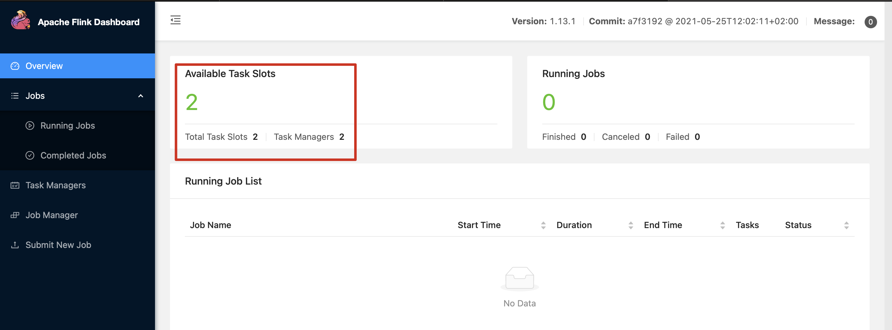
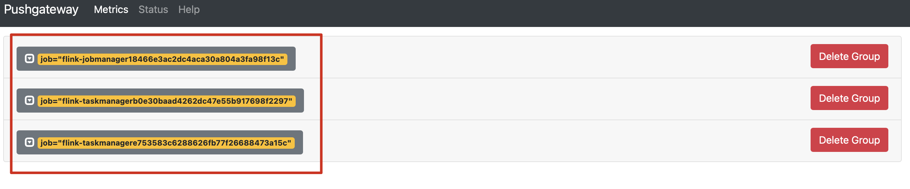
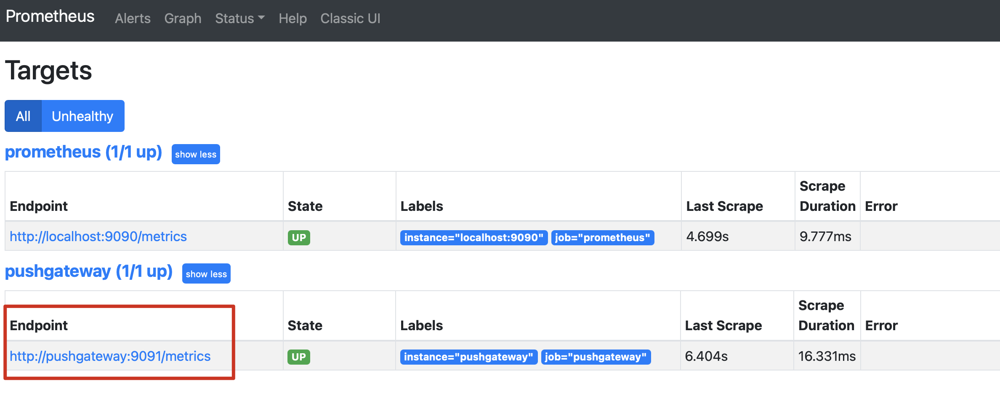
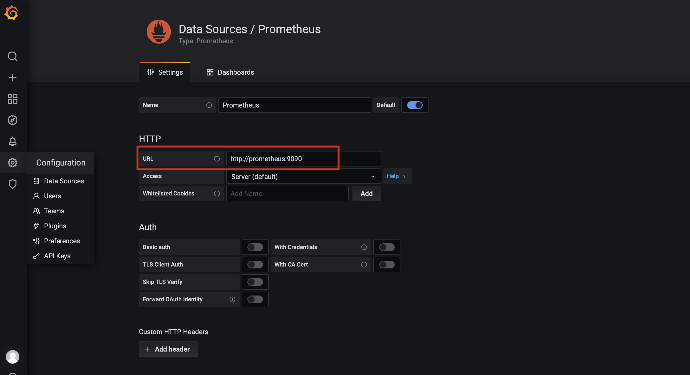
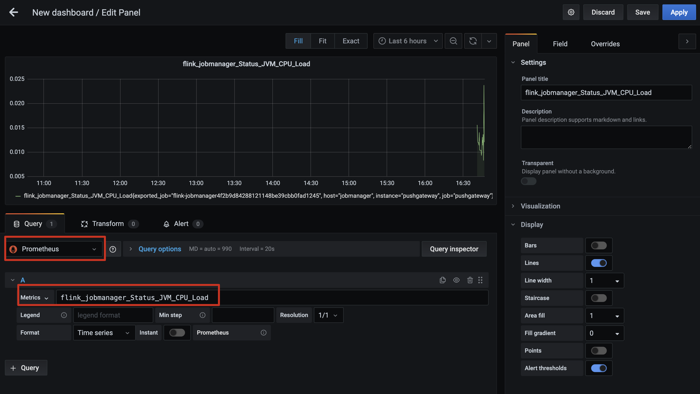
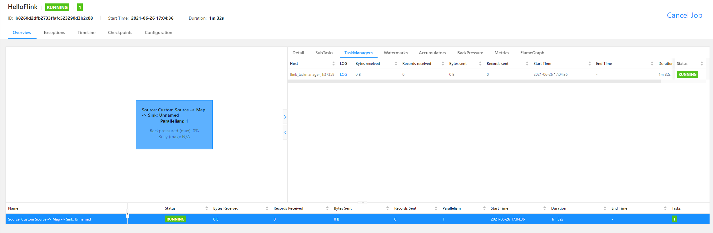
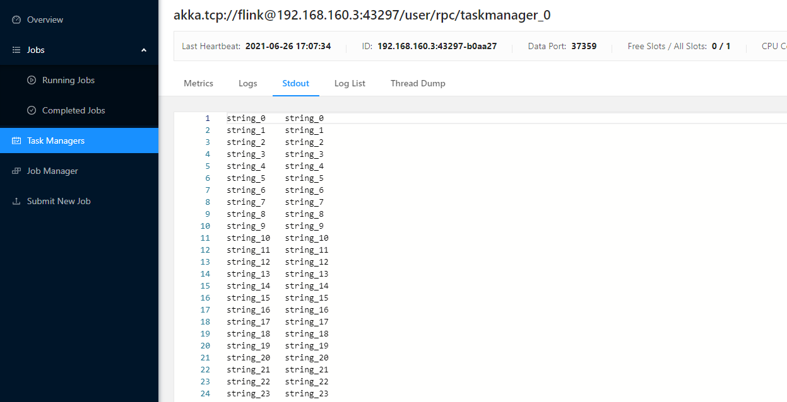
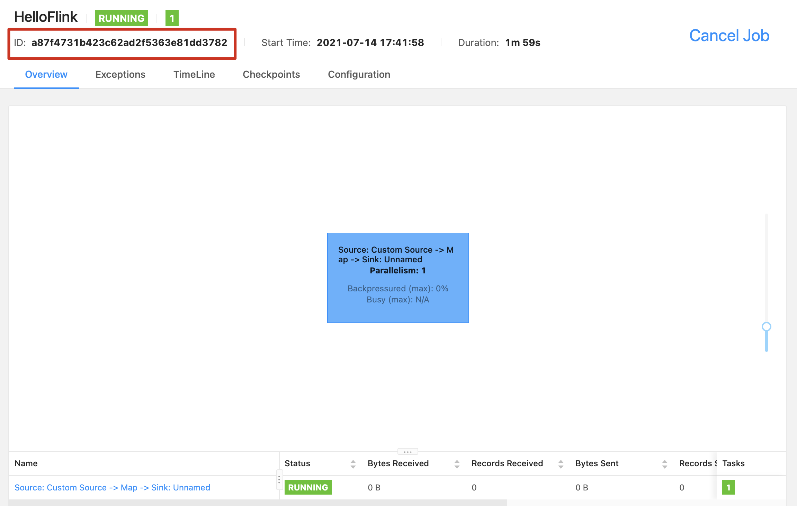

基于Docker的Flink集群部署和作业提交方法
===

## 准备工作

1. 安装最新版本的[docker](https://www.docker.com/community-edition)
2. 拉取[flink](https://hub.docker.com/_/flink), [Prometheus](https://hub.docker.com/r/prom/prometheus), [pushgateway](https://hub.docker.com/r/prom/pushgateway), [grafana](https://hub.docker.com/r/grafana/grafana)

``` shell
docker pull flink:scala_2.11-java8
#  flink-monitor 涉及额外镜像
docker pull prom/prometheus
docker pull prom/pushgateway
docker pull grafana/grafana
```

## 部署流程
 
**包含三个版本Flink集群部署方法**

1. [Flink集群部署](#flink集群部署)
    > 常规Flink集群

2. [挂载lib目录部署](#挂载lib目录部署)
   > 挂载flink客户端的lib目录，便于添加第三方依赖包

3. [Flink-Monitor集群部署]
    > 配置Flink集群的[Metrics](https://ci.apache.org/projects/flink/flink-docs-master/docs/ops/metrics/)转发至[Prometheus](https://prometheus.io/)，并通过[Grafana](https://grafana.com/)展示Metrics数据
]
自定义Flink作业提交到集群方法参考[提交自定义flink作业](#提交自定义flink作业)

### Flink集群部署

启动Flink集群
``` linux
docker compose -f docker-compose-cluster.yml up -d
```

移除Flink集群
``` linux
docker compose -f docker-compose-cluster.yml down
```

等待Flink集群启动完成后，打开`Flink Web`页面
    - http://localhost:8081/#/overview

`Flink Web`页面打开后，能看到两个taskmanager说明集群部署完成


修改集群taskmanager数量
``` linux
docker-compose -f docker-compose-cluster.yml scale taskmanager=<N>
``` 

停止和启动集群(保留容器):
``` shell
# 停止容器
docker compose -f docker-compose-cluster.yml stop
# 启动容器
docker compose -f docker-compose-cluster.yml start
```

#### 容器配置说明
为保证`Flink Web`页面可以看到STDOUT日志，因此修改entrypoint为如下启动方式，修改原理参考- [Flink Web UI不显示STDOUT问题](https://stackoverflow.com/questions/54036010/apache-flink-the-file-stdout-is-not-available-on-the-taskexecutor)

``` yml
    entrypoint: 
      - sh 
      - -c  
      - |
        sed -i 's/start-foreground/start/g' /docker-entrypoint.sh
        /docker-entrypoint.sh jobmanager
        sleep 10 && tail -f -n +0 /opt/flink/log/*
```

### 挂载lib目录部署
> 运行Flink作业时，如果涉及第三方jar包，则需要引入至Flink客户端，因此补充挂在flink lib目录的部署方式。

获取已有lib目录文件
``` shell
# 创建挂载目录
mkdir ./volumes
# 启动Flink集群
docker compose -f docker-compose-cluster.yml up -d
# 获取lib目录文件
docker cp flink_jobmanager_1:/opt/flink/lib volumes/lib
#  移除Flink集群
docker compose -f docker-compose-cluster.yml down
```

启动挂载lib的Flink集群
``` linux
docker compose -f docker-compose-cluster-with-volumes.yml up -d
```

移除集群
``` linux
docker compose -f docker-compose-cluster-with-volumes.yml down
```

`Flink Web`页面
    - http://localhost:8081/#/overview

停止和启动集群(保留容器):
``` shell
# 停止容器
docker compose -f docker-compose-cluster-with-volumes.yml stop
# 启动容器
docker compose -f docker-compose-cluster-with-volumes.yml start
```

### Flink-Monitor集群部署

> 配置Flink Metrics监控通过pushgateway转发至prometheus，并通过grafana查看Flink Session和作业的监控结果。

启动Flink集群(挂载了lib目录)
``` linux
docker compose -f docker-compose-cluster-with-monitor.yml up -d
```

移除Flink集群
``` linux
docker compose -f docker-compose-cluster-with-monitor.yml down
```

等待Flink集群启动完成后，验证以下页面是否显示正常：
- `Flink Web`: http://localhost:8081/#/overview
    
- `PushGateway`: http://localhost:9091
    
- `Prometheus`: http://localhost:9090/targets
    
- `Grafana`: http://localhost:3000/login
    - username: `admin`, password: `pulsar`
    

启动成功后，配置`Gafana`：
1. 配置`prometheus`地址为： http://prometheus:9090
    
2. 新建Dashboard，添加`prometheus`指标
    Panel配置页面可以检索到`prometheus`，并且选择相关指标后，能看到相关数据，说明部署正常
    

#### 容器启动流程

容器启动流程如下：

    ``` 
    启动pushgateway, grafana
    -> 启动prometheus
    -> 启动flink jobmanager
    -> 启动flink taskmanager
    ```

#### 容器配置说明

1. `jobmanager`和`taskmanager`新增metrics相关环境配置，参考[Flink Metrics Reporter文档](https://ci.apache.org/projects/flink/flink-docs-master/docs/deployment/metric_reporters/#prometheuspushgateway)，prometheuspushgateway部分

    ```yml
    environment:
        - |
        FLINK_PROPERTIES=
        jobmanager.rpc.address: jobmanager
        metrics.reporter.promgateway.class: org.apache.flink.metrics.prometheus.PrometheusPushGatewayReporter
        metrics.reporter.promgateway.host: pushgateway
        metrics.reporter.promgateway.port: 9091
        metrics.reporter.promgateway.jobName: flink-jobmanager
        metrics.reporter.promgateway.randomJobNameSuffix: true
        metrics.reporter.promgateway.deleteOnShutdown: false
    ```

2. `prometheus`重写entrypoint，在启动服务之前增加`pushgateway`配置
    ```yml
    entrypoint:
        - sh
        - -c
        - |
        echo -e "  - job_name: pushgateway\n    static_configs:\n      - targets: ['pushgateway:9091']\n        labels:\n          instance: pushgateway" >> /etc/prometheus/prometheus.yml
        /bin/prometheus --config.file=/etc/prometheus/prometheus.yml --storage.tsdb.path=/prometheus --web.console.libraries=/usr/share/prometheus/console_libraries --web.console.templates=/usr/share/prometheus/consoles
    ```

## 提交自定义Flink作业

### 页面提交作业

1. 登录[Flink Web](http://localhost:8081/#/overview)页面
2. 点击`Submit New Job` -> `Add New` 添加jar包
3. 以`flink-examples-1.0-SNAPSHOT.jar`为例：点击`jar`包名称 -> 配置`EntryClass`为`pers.yibo.flink.streaming.demo.hello.HelloFlink` -> 点击`submit`则可提交并运行作业

**如下所示说明作业正确运行**
<!--  -->
作业详情显示为`running`



点击作业对应的`taskmanager` -> 点击`stdout`可看到输出数据



### API方式提交作业

Flink Rest Api文档参考：[Flink Rest Api文档](https://ci.apache.org/projects/flink/flink-docs-master/docs/ops/rest_api/)

#### Api可用性验证
本地集群rest验证：
```bash
curl http://localhost:8081/config
```

返回结果如下，说明Flink Rest Api访问成功
```json
{
    "refresh-interval": 3000,
    "timezone-name": "Coordinated Universal Time",
    "timezone-offset": 0,
    "flink-version": "1.13.1",
    "flink-revision": "a7f3192 @ 2021-05-25T12:02:11+02:00",
    "features": {
        "web-submit": true
    }
}
```

#### Api可用性验证

作业提交流程：
1. 上传jar包至集群，参考接口`/jars/upload`

    ```bash
    curl -X POST -H "Expect:" -F "jarfile=@./flink-examples-1.0-SNAPSHOT.jar" http://localhost:8081/jars/upload
    ```

    返回结果如下说明上传成功，记录上传的jar包名称：`bc4303b4-7bf1-4f34-a2b2-528cd0306fba_flink-examples-1.0-SNAPSHOT.jar`
    
    ```json
    {
        "filename": "/tmp/flink-web-b4297ad8-5d61-40cd-8838-21e1f0a31997/flink-web-upload/bc4303b4-7bf1-4f34-a2b2-528cd0306fba_flink-examples-1.0-SNAPSHOT.jar",
        "status": "success"
    }
    ```

2. 运行作业，参考接口`/jars/:jarid/run`

    ```bash
    # 路径中的 jarid 为上一步的jar包名称
    curl -X POST http://localhost:8081/jars/bc4303b4-7bf1-4f34-a2b2-528cd0306fba_flink-examples-1.0-SNAPSHOT.jar/run?entry-class=pers.yibo.flink.streaming.demo.hello.HelloFlink
    ```
    返回结果为`jobid`说明作业已提交运行
    ```json
    {"jobid":"a87f4731b423c62ad2f5363e81dd3782"}
    ```

3. 页面查询作业运行情况
    可以看到上一步提交的jobid已正常运行
    

## 参考资料

- [Flink Docker文档](https://ci.apache.org/projects/flink/flink-docs-master/zh/docs/deployment/resource-providers/standalone/docker/)
- [Flink Web UI不显示STDOUT问题](https://stackoverflow.com/questions/54036010/apache-flink-the-file-stdout-is-not-available-on-the-taskexecutor)
- [Flink Metrics文档](https://ci.apache.org/projects/flink/flink-docs-master/docs/ops/metrics/)
- [Flink Metrics Reporter文档](https://ci.apache.org/projects/flink/flink-docs-master/docs/deployment/metric_reporters/#prometheuspushgateway)
- [Flink Rest Api文档](https://ci.apache.org/projects/flink/flink-docs-master/docs/ops/rest_api/)
- [Prometheus Docker文档](https://prometheus.io/docs/prometheus/latest/installation/)
- [Grafana Docker部署文档](https://grafana.com/docs/grafana/latest/installation/docker/)