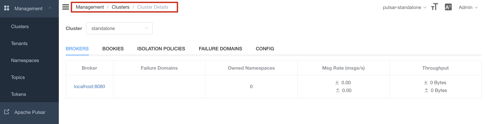
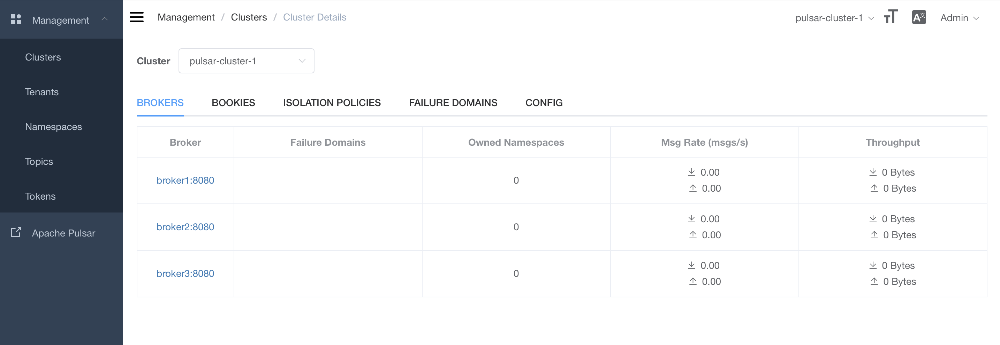
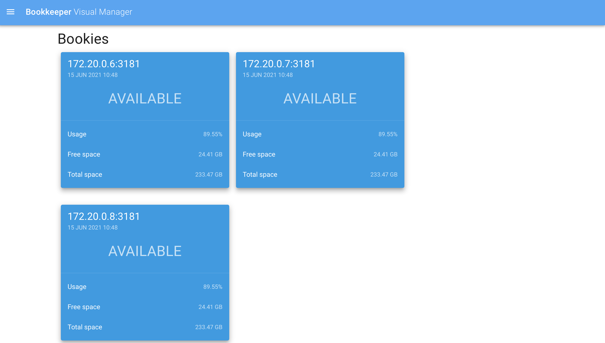

基于Docker的pulsar集群部署方法
===

## 准备工作

1. 安装最新版本的[docker](https://www.docker.com/community-edition)
2. 拉取[pulsar](https://hub.docker.com/r/apachepulsar/pulsar)和[pulsar-manager](https://hub.docker.com/r/apachepulsar/pulsar-manager)镜像

``` linux
docker pull apachepulsar/pulsar:2.7.2
docker pull apachepulsar/pulsar-manager:v0.2.0
```

## 部署流程

### standalone方式部署

启动容器：
``` linux
sh startStandalone.sh
```

等待`pulsar-manager`启动完成后，初始化管理员信息：
``` linux
sh initAccount.sh
```

显示以下内容说明管理员信息初始化成功：
``` log
> sh initAccount.sh
  % Total    % Received % Xferd  Average Speed   Time    Time     Time  Current
                                 Dload  Upload   Total   Spent    Left  Speed
100    36  100    36    0     0    130      0 --:--:-- --:--:-- --:--:--   130
{"message":"Add super user success, please login"}%
```

管理员信息初始化完成后，可从以下地址登入：
> pulsar-manager: http://127.0.0.1:9527/# 
> username: `admin`, password: `pulsar`

构建成功后，点击 Clusters -> Cluster Name: standalone -> BROKERS ，可看到broker列表说明`standalone`方式部署完成



删除容器：
``` linux
sh stopStandalone.sh
```

#### standalone方式容器说明
`pulsar-standalone`容器
    - 配置了集群url地址为`pulsar-standalone`（便于`pulsar-manager`容器管理）
    - 未挂载数据盘，每次启动均为新实例
``` linux
docker run -itd \
    --name pulsar-standalone \
    -p 6650:6650 \
    -p 8080:8080 \
    apachepulsar/pulsar:2.7.2 \
    sh -c  "bin/pulsar standalone > pulsar.log 2>&1 & \
            sleep 30 && bin/pulsar-admin clusters update standalone \
            --url http://pulsar-standalone:8080 \
            --broker-url pulsar://pulsar-standalone:6650 & \
            tail -F pulsar.log"
```

`pulsar-manager`容器
    - 配置了默认集群环境
    - 修改容器日志为`后端日志`
``` linux
docker run -itd \
    --name pulsar-manager \
    -p 9527:9527 -p 7750:7750 \
    -e SPRING_CONFIGURATION_FILE=/pulsar-manager/pulsar-manager/application.properties \
    --link pulsar-standalone \
    --entrypoint="" \
    apachepulsar/pulsar-manager:v0.2.0 \
    sh -c  "sed -i '/^default.environment.name/ s|.*|default.environment.name=pulsar-standalone|' /pulsar-manager/pulsar-manager/application.properties & \
            sed -i '/^default.environment.service_url/ s|.*|default.environment.service_url=http://pulsar-standalone:8080|' /pulsar-manager/pulsar-manager/application.properties & \
            /pulsar-manager/entrypoint.sh & \
            tail -F /pulsar-manager/pulsar-manager/pulsar-manager.log"
```

### cluster方式部署

启动集群(自动新建初始化数据目录`data`)：
``` linux
sh startCluster.sh
```

等待`pulsar-manager`启动完成后，初始化管理员信息：
``` linux
sh initAccount.sh
```

显示以下内容说明管理员信息初始化成功：
``` log
> sh initAccount.sh
  % Total    % Received % Xferd  Average Speed   Time    Time     Time  Current
                                 Dload  Upload   Total   Spent    Left  Speed
100    36  100    36    0     0    130      0 --:--:-- --:--:-- --:--:--   130
{"message":"Add super user success, please login"}%
```

管理员信息初始化完成后，可从以下地址登入：
- Pulsar Manager
    > http://127.0.0.1:9527/#  
    > username: `admin`, password: `pulsar`
- BookKeeper Visual Manager
    > http://127.0.0.1:7750/bkvm/#/login
    > username: `admin`, password: `admin`

构建成功后，以下两个页面正常说明`cluster`方式部署完成
- 点击 Clusters -> Cluster Name: pulsar-cluster-1 -> BROKERS ，可看到broker列表
    
- 进入`BookKeeper Visual Manager`可看到3个BookKeeper节点
    

删除集群(保留数据目录)：
``` linux
sh stopCluster.sh
```

#### cluster方式容器说明
容器启动流程如下：

    ``` 
    Zookeeper节点(zk1, zk2, zk3) 
    -> 初始化集群元数据(init-metadata) 
    -> Bookeeper节点(bookie1, bookie2, bookie3)
    -> puslar broker节点(broker1, broker2, broker3)
    -> 反向代理节点(pulsar-proxy)
    -> pulsar manager节点(dashboard)
    ```

配置文件参考`conf`目录，数据目录为`data`，具体参考[docker-compose-cluster.yml](docker-compose-cluster.yml)

所有容器的重启策略为失败后重启
   ``` yml
   restart: on-failure
   ```

日志均可通过`docker logs <container-name>`查看

## 参考资料

- [在 Docker 里配置单机 Pulsar](https://pulsar.apache.org/docs/zh-CN/next/standalone-docker/)
- [pulsar集群元数据管理](https://pulsar.apache.org/docs/zh-CN/next/admin-api-clusters/)
- [github: pulsar-manager](https://github.com/apache/pulsar-manager)
